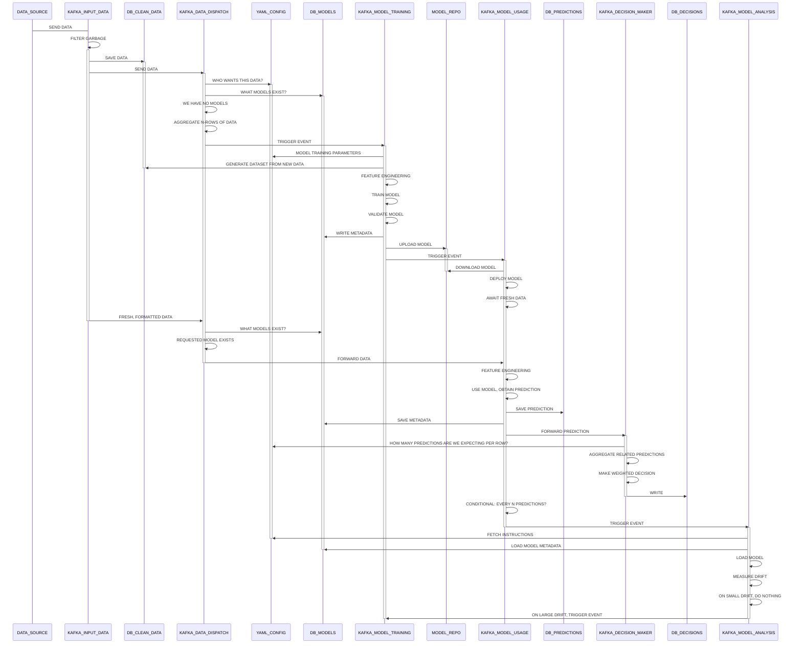

```mermaid
sequenceDiagram
    DATA_SOURCE -> KAFKA_INPUT_DATA: SEND DATA

    KAFKA_INPUT_DATA ->> KAFKA_INPUT_DATA: FILTER GARBAGE
    activate KAFKA_INPUT_DATA
    KAFKA_INPUT_DATA ->> DB_CLEAN_DATA: SAVE DATA
    activate DB_CLEAN_DATA
    KAFKA_INPUT_DATA ->> KAFKA_DATA_DISPATCH: SEND DATA

    activate KAFKA_DATA_DISPATCH
    KAFKA_DATA_DISPATCH ->> YAML_CONFIG: WHO WANTS THIS DATA?
    activate YAML_CONFIG
    KAFKA_DATA_DISPATCH ->> DB_MODELS: WHAT MODELS EXIST?
    activate DB_MODELS
    KAFKA_DATA_DISPATCH ->> KAFKA_DATA_DISPATCH: WE HAVE NO MODELS
    KAFKA_DATA_DISPATCH ->> KAFKA_DATA_DISPATCH: AGGREGATE N-ROWS OF DATA
    KAFKA_DATA_DISPATCH ->> KAFKA_MODEL_TRAINING: TRIGGER EVENT

    activate KAFKA_MODEL_TRAINING
    KAFKA_MODEL_TRAINING ->> YAML_CONFIG: MODEL TRAINING PARAMETERS
    KAFKA_MODEL_TRAINING ->> DB_CLEAN_DATA: GENERATE DATASET FROM NEW DATA
    deactivate DB_CLEAN_DATA
    KAFKA_MODEL_TRAINING ->> KAFKA_MODEL_TRAINING: FEATURE ENGINEERING
    KAFKA_MODEL_TRAINING ->> KAFKA_MODEL_TRAINING: TRAIN MODEL
    KAFKA_MODEL_TRAINING ->> KAFKA_MODEL_TRAINING: VALIDATE MODEL
    KAFKA_MODEL_TRAINING ->> DB_MODELS: WRITE METADATA
    KAFKA_MODEL_TRAINING ->> MODEL_REPO: UPLOAD MODEL
    activate MODEL_REPO
    KAFKA_MODEL_TRAINING ->> KAFKA_MODEL_USAGE: TRIGGER EVENT

    activate KAFKA_MODEL_USAGE
    KAFKA_MODEL_USAGE ->> MODEL_REPO: DOWNLOAD MODEL
    deactivate MODEL_REPO
    KAFKA_MODEL_USAGE ->> KAFKA_MODEL_USAGE: DEPLOY MODEL
    KAFKA_MODEL_USAGE ->> KAFKA_MODEL_USAGE: AWAIT FRESH DATA

    KAFKA_INPUT_DATA ->> KAFKA_DATA_DISPATCH: FRESH, FORMATTED DATA
    deactivate KAFKA_INPUT_DATA
    KAFKA_DATA_DISPATCH ->> DB_MODELS: WHAT MODELS EXIST?
    KAFKA_DATA_DISPATCH ->> KAFKA_DATA_DISPATCH: REQUESTED MODEL EXISTS
    KAFKA_DATA_DISPATCH ->> KAFKA_MODEL_USAGE: FORWARD DATA
    deactivate KAFKA_DATA_DISPATCH

    KAFKA_MODEL_USAGE ->> KAFKA_MODEL_USAGE: FEATURE ENGINEERING
    KAFKA_MODEL_USAGE ->> KAFKA_MODEL_USAGE: USE MODEL, OBTAIN PREDICTION
    KAFKA_MODEL_USAGE ->> DB_PREDICTIONS: SAVE PREDICTION
    KAFKA_MODEL_USAGE ->> DB_MODELS: SAVE METADATA

    KAFKA_MODEL_USAGE ->> KAFKA_DECISION_MAKER: FORWARD PREDICTION

    activate KAFKA_DECISION_MAKER
    KAFKA_DECISION_MAKER ->> YAML_CONFIG: HOW MANY PREDICTIONS ARE WE EXPECTING PER ROW?
    KAFKA_DECISION_MAKER ->> KAFKA_DECISION_MAKER: AGGREGATE RELATED PREDICTIONS
    KAFKA_DECISION_MAKER ->> KAFKA_DECISION_MAKER: MAKE WEIGHTED DECISION
    KAFKA_DECISION_MAKER ->> DB_DECISIONS: WRITE
    deactivate KAFKA_DECISION_MAKER

    KAFKA_MODEL_USAGE ->> KAFKA_MODEL_USAGE: CONDITIONAL: EVERY N PREDICTIONS?
    KAFKA_MODEL_USAGE ->> KAFKA_MODEL_ANALYSIS: TRIGGER EVENT
    deactivate KAFKA_MODEL_USAGE

    activate KAFKA_MODEL_ANALYSIS
    KAFKA_MODEL_ANALYSIS ->> YAML_CONFIG: FETCH INSTRUCTIONS
    deactivate YAML_CONFIG
    KAFKA_MODEL_ANALYSIS ->> DB_MODELS: LOAD MODEL METADATA
    deactivate DB_MODELS
    KAFKA_MODEL_ANALYSIS ->> KAFKA_MODEL_ANALYSIS: LOAD MODEL
    KAFKA_MODEL_ANALYSIS ->> KAFKA_MODEL_ANALYSIS: MEASURE DRIFT
    KAFKA_MODEL_ANALYSIS ->> KAFKA_MODEL_ANALYSIS: ON SMALL DRIFT, DO NOTHING
    KAFKA_MODEL_ANALYSIS ->> KAFKA_MODEL_TRAINING: ON LARGE DRIFT, TRIGGER EVENT
    deactivate KAFKA_MODEL_ANALYSIS
    deactivate KAFKA_MODEL_TRAINING
```