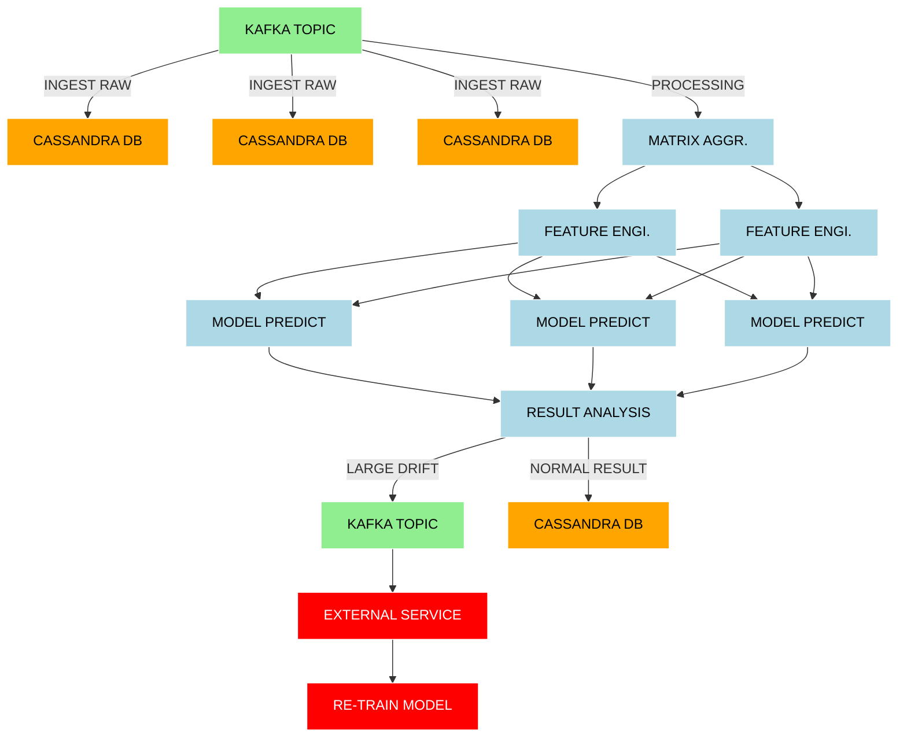

<!--- https://github.com/mermaid-js/mermaid -->

```mermaid
    flowchart TB
        classDef orange fill:orange,color:black,stroke:white
        classDef green fill:lightgreen,color:black,stroke:white
        classDef blue fill:lightblue,color:black,stroke:white
        classDef red fill:red,color:white,stroke:white

    %%%%%%%%%%%%%%%%%%%%%%%%%%%%%%%%%%%%%%%%%%%%%%%%%%
    %%%%%%%%%%%%%%%%%%%%%%%%%%%%%%%%%%%%%%%%%%%%%%%%%%

        A[KAFKA TOPIC]:::green
        
        B1[CASSANDRA DB]:::orange
        B2[CASSANDRA DB]:::orange
        B3[CASSANDRA DB]:::orange

        C[MATRIX AGGR.]:::blue

        D1[FEATURE ENGI.]:::blue
        D2[FEATURE ENGI.]:::blue

        E2[MODEL PREDICT]:::blue
        E3[MODEL PREDICT]:::blue
        E1[MODEL PREDICT]:::blue

        F[RESULT ANALYSIS]:::blue

        G[KAFKA TOPIC]:::green
        H[CASSANDRA DB]:::orange

        I[EXTERNAL SERVICE]:::red
        J[RE-TRAIN MODEL]:::red

    %%%%%%%%%%%%%%%%%%%%%%%%%%%%%%%%%%%%%%%%%%%%%%%%%%
    %%%%%%%%%%%%%%%%%%%%%%%%%%%%%%%%%%%%%%%%%%%%%%%%%%

        A -- INGEST RAW --> B1 & B2 & B3
        A -- PROCESSING --> C

        C --> D1 & D2
        D1 & D2 --> E1 & E2 & E3
        E1 & E2 & E3 --> F

        F -- LARGE DRIFT --> G
        F -- NORMAL RESULT --> H
        G --> I
        I --> J
```
